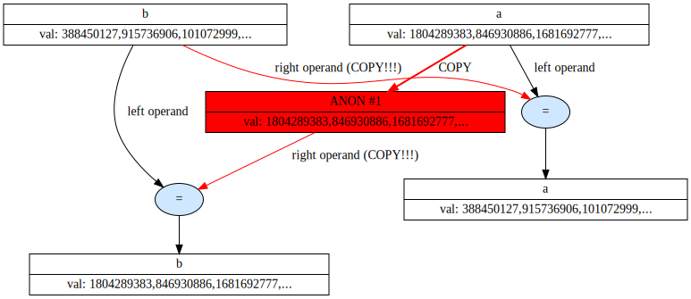
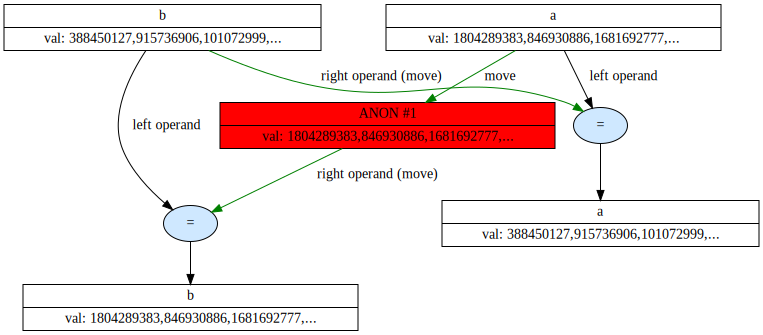
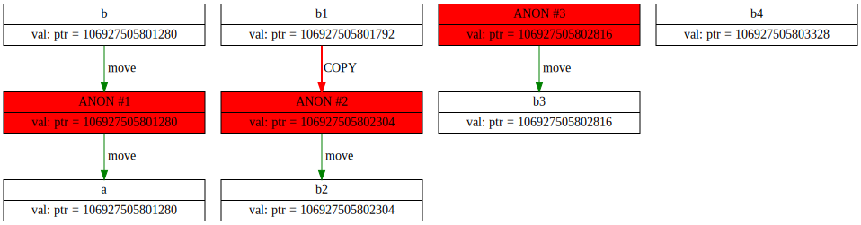

# TrackerClass
So, target is to track all constructors of target class T, and get detailed understanding where copy/move constructors called and how much copies created.
Using flag -fno-elide-constructors, we can see additional copies.

## main.cpp
main.cpp: just example of tracker usage, see the log.html. To see graph use graphviz:
```
dot -Tsvg graph.txt > graph
```

## example1.cpp
This just shows how move can be used to speed up the programm. On the graph you can see red arrows of copying and green arrows of moving.

the slow version


the "fast" version


potomushto dora dura superdura dora dura...

## example2.cpp
This is the example of wrong move usage (created b, it moved to a, so has big_array=nullptr, but still expected to be valid and memory will be released) and how forward fixes it

The illustration (It is not fair because you can't spawn graph when your program gets segfault, this graph was created when we skip the line with checking b.big_array[0]. Other chains of variable are correct.)

### my own remove reference, move, forward
mystd.hpp have my own versions remove_reference, move and forward written for educational purposes
